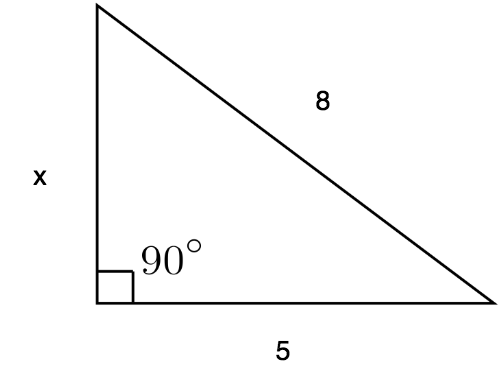

# Variables and Operators - Exercises

## Exercise 1 - Variable types

Look at `./exercise-1.js`, it asks what type is of the listed variables. There is a JS function which returns the type of a passed argument.

Once you've identified the function, cast it upon each of the variables in the exercise and output them to the console.

## Exercise 2 - Math

### a > Circles

The **Math** library comes with almost all JavaScript environments. Within it are useful resources for calculating mathematical queries.

In `./exercise-2.js`, write code in the first portion which calculates the circumference and area of a circle with a diameter of 15.  
_Note: Your answer should be rounded to 2 decimal places._

### b > Triangles

Below, is a right-angled triangle with an unknown length for one of its sides. Using Pythagoras's theorem, calculate the length of this unknown side. Write the code in `./exercise-2.js`.
_Note: Your answer should be rounded to 2 decimal places._

## Exercise 3 - Random

In `./exercise-3.js`, write code for the declaration of the variable `a` which sets it to a random integer from 1 to 1000 each time you run the script.
